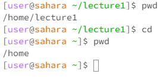
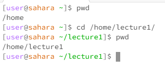
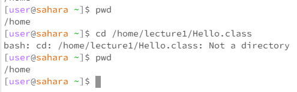
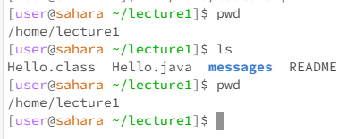
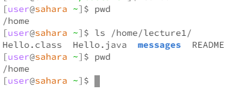
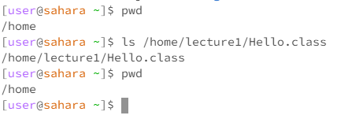
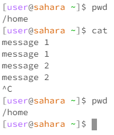
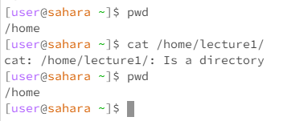

# Lab 1

CD No Args

The working directory when the command is run is  "/home/lecture1". CD is supposed to be given a path to change to. Since there is no path, the current directory changes to one level above it. The working directory changes from "/home/lecture1" to "/home". The output is not an error since there was no output.

CD Directory Arg

The working directory when the command is run is "/home". When given a directory, it changes the current working directory to the one passed to it. The output has no errors. The working directory changes from "/home" to "/home/lecture1".

CD File Arg

The working directory when the command is run is "/home". When given a file, it does not know what to do since it was expecting a directory. You can't change the current working directory to something that is not a directory. This is why the output has an error. Since this is an error, the working directory doesn't change. The working directory is "/home" before and after the command is run.

LS No Args

The working directory when the command is run is "/home/lecture1". When given no arguments, the command prints the contents of the current working directory. The output has no errors. The working directory is "/home/lecture1" before and after the command is run.

LS Directory Args

The working directory when the command is run is "/home". When given a directory, the command prints the contents of the directory passed to it. The output has no errors. The working directory is "/home" before and after the command is run.

LS File Args

The working directory when the command is run is "/home". When given a file, the commands print the requested information of a file. Since no requests were made here, it just prints the name. The output has no errors. working directory is "/home" before and after the command is run.

CAT No Args

The working directory when the command is run is "/home". When given no arguments. It prints what is written to STDIN. After typing each message, it reprints it. The output has no errors. The working directory is "/home" before and after the command is run.

CAT Directory Arg

The working directory when the command is run is "/home". CAT is supposed to print the contents of the passed file. CAT does not know what to do with a directory since it is not a file. This is why the output has an error. The working directory is "/home" before and after the command is run.

CAT File Arg

The working directory when the command is run is "/home". "When given a file, it prints the contents of the file. The output has no errors. THe working directory is "/home" before and after the command is run.
