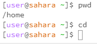
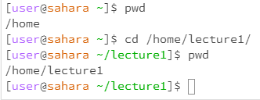
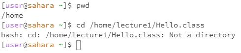
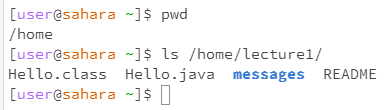
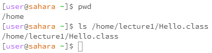
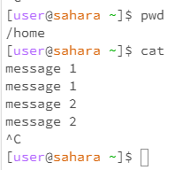
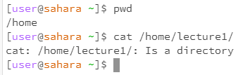
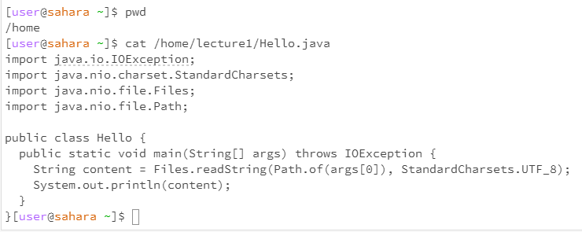

# Lab 1

CD No Args

CD is supposed to be given a path to change to. Since there is no path, the current directory hasn't been changed. The output is not an error since there was no output.

CD Directory Arg

When given a directory, it changes the current working directory to the one passed to it. As you can see, after the command is executed, the directory changes from "/home" to "/home/lecture1". The output has no errors.

CD File Arg

When given a file, it does not know what to do since it was expecting a directory. You can't change the current working directory to something that is not a directory. This is why the output has an error.

LS No Args

When given no commands, the command prints the contents of the current working directory. The output has no errors.

LS Directory Args

When given a directory, the command prints the contents of the directory passed to it. The output has no errors.

LS File Args

When given a file, the commands prints the requested information of a file. Since no requests were made here, it just prints the name. The output has no errors.

CAT No Args

When given no arguments. It prints what is written to STDIN. After typing each message, it reprints it. The output has no errors.

CAT Directory Arg

CAT is supposed to print the contents of the passed file. CAT does not know what to do with a directory since it is not a file. This is why the ouput has an error.

CAT File Arg

When given a file, it prints the contents of the file. The output has no errors.
