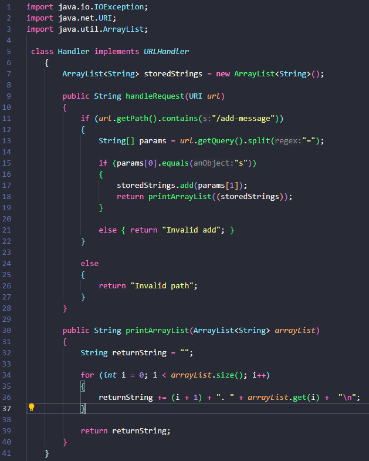
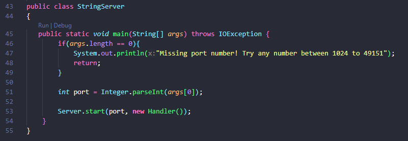
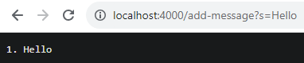
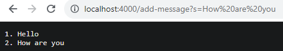
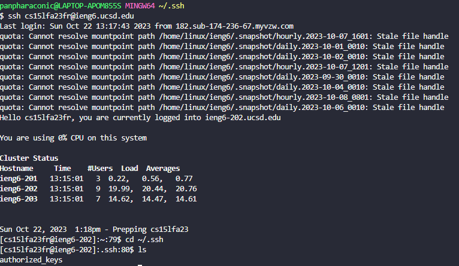

# Lab 2

## Part 1

Within `main()`, `Server.start(port, new Handler())` is called. Port is the port number of the server passed in from the program call. A new handler is passed to the server so it can receive and handle incoming events. Within the handler class, there is an ArrayList<String> that stores all the strings passed to the server. `handleRequest(URI url)` handles requests sent to the server. `url` is the url of the request. On line 11, the code checks to see if the url contains the path "/add-message". If it does, it gets all queries. If the query contains an s, it stores the passed string in the server and calls `printArrayList(ArrayList<String>)` and returns the results. `printArrayList(ArrayList<String>` formats the contents of the ArrayList<String> into the format "<position>. <string>". If the path does not "/add-message", an error is returned.

## Part 2

## Part 3

This week I learned that ssh keys can be generated with `ssh-keygen`. I also learned that the private key is stored in "~/.ssh" on the connecting machine and the public key is stored in "~/.ssh/authorized_keys" on the connected machine.
