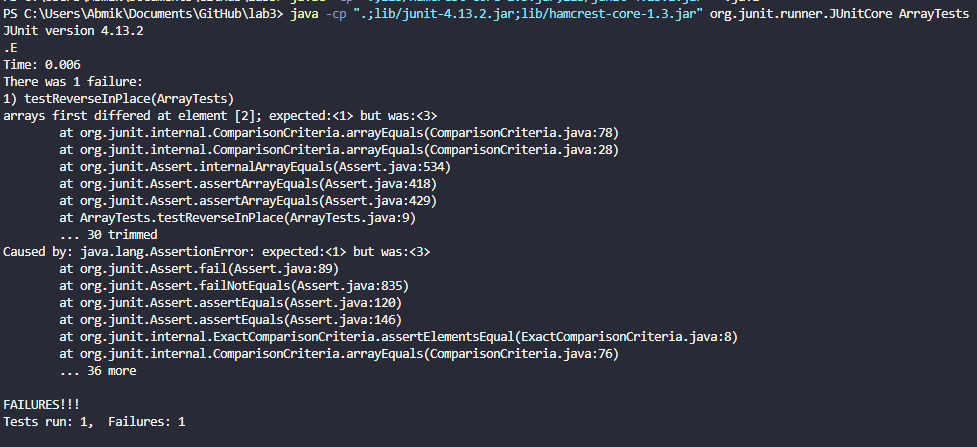
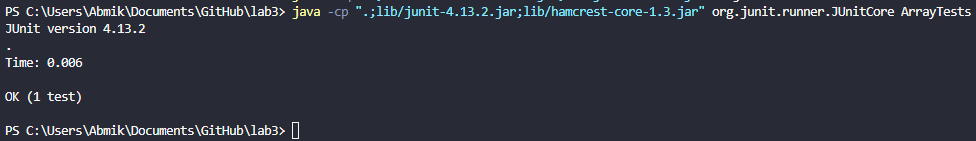

# Lab 3

## Part 1

### Failure Inducing Input:

```
  @Test 

  public void testReverseInPlaceBad() {
  
    int[] input1 = { 1, 2, 3 };
    
    ArrayExamples.reverseInPlace(input1);
    
    assertArrayEquals(new int[]{ 3, 2, 1 }, input1);
    
  }
```



### Non-Failure Inducing Input:

```
    @Test

    public void testReverseInPlace() {

      int[] input1 = { };

      ArrayExamples.reverseInPlace(input1);

      assertArrayEquals(new int[]{ }, input1);

    }
```



### Bug (Before and After Fix)

```
static void reverseInPlaceBad(int[] arr) {

    for(int i = 0; i < arr.length; i += 1) {

      arr[i] = arr[arr.length - i - 1];

    }

  }
```

```
  static void reverseInPlace(int[] arr) 

  {

    for (int i = 0; i < arr.length / 2; i++) 

    {

      int temp = arr[i];

      arr[i] = arr[arr.length - i - 1];

      arr[arr.length - i - 1] = temp;

    }

  }
```

The bug within the code is that it doesn't swap the elements. The code only assigns the value on the left with the value on the right. This works only works for the first half of the array. For the second half of the array, it gains the values right, which has already been reassigned to the second half, resulting in no change for the second half. The fix changes how long the `for` loop runs and introduces an `int`. The `int` holds the value of the left so it doesn't get lost after getting reassigned. After the beginning part of the array is assigned, the latter part is given the value of the `int`, which is the value from the first half. Since both ends are being swapped at the same time, the `for` loop iterates for half of the length.

## Part 2
Source - https://phoenixnap.com/kb/less-command-in-linux

`less -m chapter-1.txt`

```
"WE HAVE SOME PLANES"

    Tuesday, September 11, 2001, dawned temperate and nearly cloudless in the eastern United States. Millions of men and women readied themselves for work. Some made their way to the Twin Towers, the signature structures of the World Trade Center complex in New York City. Others went to Arlington, Virginia, to the Pentagon. Across the Potomac River, the United States Congress was back in session. At the other end of Pennsylvania Avenue, people began to line up for a White House tour. In Sarasota, Florida, President George W. Bush went for an early morning run.

    For those heading to an airport, weather conditions could not have been better for a safe and pleasant journey. Among the travelers were Mohamed Atta and Abdul Aziz al Omari, who arrived at the airport in Portland, Maine.

INSIDE THE FOUR FLIGHTS

Boarding the Flights

    Boston: American 11 and United 175. Atta and Omari boarded a 6:00 A.M. flight from Portland to Boston's Logan International Airport.

    When he checked in for his flight to Boston, Atta was selected by a computerized prescreening system known as CAPPS (Computer Assisted Passenger Prescreening System), created to identify passengers who should be subject to special security measures. Under security rules in place at the time, the only consequence of Atta's selection by CAPPS was that his checked bags were held off the plane until it was confirmed that he had boarded the aircraft. This did not hinder Atta's plans.

    Atta and Omari arrived in Boston at 6:45. Seven minutes later, Atta apparently took a call from Marwan al Shehhi, a longtime colleague who was at another terminal at Logan Airport. They spoke for three minutes.

chapter-1.txt 1%
```

`$ less -m chapter-2.txt`

```
            THE FOUNDATION OF THE NEW TERRORISM
            A DECLARATION OF WAR
            In February 1998, the 40-year-old Saudi exile Usama Bin Ladin and a fugitive Egyptian
                physician, Ayman al Zawahiri, arranged from their Afghan headquarters for an Arabic
                newspaper in London to publish what they termed a fatwa issued in the name of a
                "World Islamic Front." A fatwa is normally an interpretation of Islamic law by a
                respected Islamic authority, but neither Bin Ladin, Zawahiri, nor the three others
                who signed this statement were scholars of Islamic law. Claiming that America had
                declared war against God and his messenger, they called for the murder of any
                American, anywhere on earth, as the "individual duty for every Muslim who can do it
                in any country in which it is possible to do it."

            Three months later, when interviewed in Afghanistan by ABC-TV, Bin Ladin enlarged on
                these themes.

            He claimed it was more important for Muslims to kill Americans than to kill other
                infidels." It is far better for anyone to kill a single American soldier than to
                squander his efforts on other activities," he said. Asked whether he approved of
                terrorism and of attacks on civilians, he replied:"We believe that the worst thieves
                in the world today and the worst terrorists are the Americans. Nothing could stop
                you except perhaps retaliation in kind. We do not have to differentiate between
                military or civilian. As far as we are concerned, they are all targets." Note:
chapter-2.txt 2%
```

`-m` shows how far you are in the file relative to the entire size as a percentage at the bottom. This is useful for seeing how large a file is (relatively) and how far in it you are.

`less -N chapter-1.txt`

```
      1
      2
      3
      4 "WE HAVE SOME PLANES"
      5
      6     Tuesday, September 11, 2001, dawned temperate and nearly cloudless in the eastern United States. Millions of men and women readied themselves for work. Some made their way to the Twin Towers, t      6 he signature structures of the World Trade Center complex in New York City. Others went to Arlington, Virginia, to the Pentagon. Across the Potomac River, the United States Congress was back in ses
      6 sion. At the other end of Pennsylvania Avenue, people began to line up for a White House tour. In Sarasota, Florida, President George W. Bush went for an early morning run.
      7
      8     For those heading to an airport, weather conditions could not have been better for a safe and pleasant journey. Among the travelers were Mohamed Atta and Abdul Aziz al Omari, who arrived at the
      8  airport in Portland, Maine.
      9
     10 INSIDE THE FOUR FLIGHTS
     11
     12 Boarding the Flights
     13
     14     Boston: American 11 and United 175. Atta and Omari boarded a 6:00 A.M. flight from Portland to Boston's Logan International Airport.
     15 
     16     When he checked in for his flight to Boston, Atta was selected by a computerized prescreening system known as CAPPS (Computer Assisted Passenger Prescreening System), created to identify passen     16 gers who should be subject to special security measures. Under security rules in place at the time, the only consequence of Atta's selection by CAPPS was that his checked bags were held off the pla
     16 ne until it was confirmed that he had boarded the aircraft. This did not hinder Atta's plans.
     17
     18     Atta and Omari arrived in Boston at 6:45. Seven minutes later, Atta apparently took a call from Marwan al Shehhi, a longtime colleague who was at another terminal at Logan Airport. They spoke f
     18 or three minutes.
     19
chapter-1.txt
```

`$ less -N chapter-2.txt`

```
      1
      2
      3
      4             THE FOUNDATION OF THE NEW TERRORISM
      5             A DECLARATION OF WAR
      6             In February 1998, the 40-year-old Saudi exile Usama Bin Ladin and a fugitive Egyptian
      7                 physician, Ayman al Zawahiri, arranged from their Afghan headquarters for an Arabic
      8                 newspaper in London to publish what they termed a fatwa issued in the name of a
      9                 "World Islamic Front." A fatwa is normally an interpretation of Islamic law by a
     10                 respected Islamic authority, but neither Bin Ladin, Zawahiri, nor the three others
     11                 who signed this statement were scholars of Islamic law. Claiming that America had
     12                 declared war against God and his messenger, they called for the murder of any
     13                 American, anywhere on earth, as the "individual duty for every Muslim who can do it
     14                 in any country in which it is possible to do it."
     15
     16             Three months later, when interviewed in Afghanistan by ABC-TV, Bin Ladin enlarged on
     17                 these themes.
     18
     19             He claimed it was more important for Muslims to kill Americans than to kill other
     20                 infidels." It is far better for anyone to kill a single American soldier than to
     21                 squander his efforts on other activities," he said. Asked whether he approved of
     22                 terrorism and of attacks on civilians, he replied:"We believe that the worst thieves
     23                 in the world today and the worst terrorists are the Americans. Nothing could stop
     24                 you except perhaps retaliation in kind. We do not have to differentiate between
     25                 military or civilian. As far as we are concerned, they are all targets." Note:
chapter-2.txt
```

`-N` is used to show the line numbers of the file. This is useful as it helps you indicate where you are in the file.

```
panpharaconic@LAPTOP-APOM855S MINGW64 ~/Documents/GitHub/docsearch/technical/911report (main)
$ less -X chapter-1.txt


"WE HAVE SOME PLANES"

    Tuesday, September 11, 2001, dawned temperate and nearly cloudless in the eastern United States. Millions of men and women readied themselves for work. Some made their way to the Twin Towers, the signature structures of the World Trade Center complex in New York City. Others went to Arlington, Virginia, to the Pentagon. Across the Potomac River, the United States Congress was back in session. At the other end of Pennsylvania Avenue, people began to line up for a White House tour. In Sarasota, Florida, President George W. Bush went for an early morning run.

    For those heading to an airport, weather conditions could not have been better for a safe and pleasant journey. Among the travelers were Mohamed Atta and Abdul Aziz al Omari, who arrived at the airport in Portland, Maine.

INSIDE THE FOUR FLIGHTS

Boarding the Flights

    Boston: American 11 and United 175. Atta and Omari boarded a 6:00 A.M. flight from Portland to Boston's Logan International Airport.

    When he checked in for his flight to Boston, Atta was selected by a computerized prescreening system known as CAPPS (Computer Assisted Passenger Prescreening System), created to identify passengers who should be subject to special security measures. Under security rules in place at the time, the only consequence of Atta's selection by CAPPS was that his checked bags were held off the plane until it was confirmed that he had boarded the aircraft. This did not hinder Atta's plans.

    Atta and Omari arrived in Boston at 6:45. Seven minutes later, Atta apparently took a call from Marwan al Shehhi, a longtime colleague who was at another terminal at Logan Airport. They spoke for three minutes.


panpharaconic@LAPTOP-APOM855S MINGW64 ~/Documents/GitHub/docsearch/technical/911report (main)
```

```
panpharaconic@LAPTOP-APOM855S MINGW64 ~/Documents/GitHub/docsearch/technical/911report (main)
$ less -X chapter-2.txt


            THE FOUNDATION OF THE NEW TERRORISM
            A DECLARATION OF WAR
            In February 1998, the 40-year-old Saudi exile Usama Bin Ladin and a fugitive Egyptian
                physician, Ayman al Zawahiri, arranged from their Afghan headquarters for an Arabic
                newspaper in London to publish what they termed a fatwa issued in the name of a
                "World Islamic Front." A fatwa is normally an interpretation of Islamic law by a
                respected Islamic authority, but neither Bin Ladin, Zawahiri, nor the three others
                who signed this statement were scholars of Islamic law. Claiming that America had
                declared war against God and his messenger, they called for the murder of any
                American, anywhere on earth, as the "individual duty for every Muslim who can do it
                in any country in which it is possible to do it."

            Three months later, when interviewed in Afghanistan by ABC-TV, Bin Ladin enlarged on
                these themes.

            He claimed it was more important for Muslims to kill Americans than to kill other
                infidels." It is far better for anyone to kill a single American soldier than to
                squander his efforts on other activities," he said. Asked whether he approved of
                terrorism and of attacks on civilians, he replied:"We believe that the worst thieves
                in the world today and the worst terrorists are the Americans. Nothing could stop
                you except perhaps retaliation in kind. We do not have to differentiate between
                military or civilian. As far as we are concerned, they are all targets." Note:

panpharaconic@LAPTOP-APOM855S MINGW64 ~/Documents/GitHub/docsearch/technical/911report (main)
```

`-X` is used to disable the clearing less' contents from the terminal after closing. This is useful if you want to view the contents as the same time as the terminal or pipe the output into a file.

`$ less -M chapter-1.txt`

```
"WE HAVE SOME PLANES"

    Tuesday, September 11, 2001, dawned temperate and nearly cloudless in the eastern United States. Millions of men and women readied themselves for work. Some made their way to the Twin Towers, the signature structures of the World Trade Center complex in New York City. Others went to Arlington, Virginia, to the Pentagon. Across the Potomac River, the United States Congress was back in session. At the other end of Pennsylvania Avenue, people began to line up for a White House tour. In Sarasota, Florida, President George W. Bush went for an early morning run.

    For those heading to an airport, weather conditions could not have been better for a safe and pleasant journey. Among the travelers were Mohamed Atta and Abdul Aziz al Omari, who arrived at the airport in Portland, Maine.

INSIDE THE FOUR FLIGHTS

Boarding the Flights

    Boston: American 11 and United 175. Atta and Omari boarded a 6:00 A.M. flight from Portland to Boston's Logan International Airport.

    When he checked in for his flight to Boston, Atta was selected by a computerized prescreening system known as CAPPS (Computer Assisted Passenger Prescreening System), created to identify passengers who should be subject to special security measures. Under security rules in place at the time, the only consequence of Atta's selection by CAPPS was that his checked bags were held off the plane until it was confirmed that he had boarded the aircraft. This did not hinder Atta's plans.

    Atta and Omari arrived in Boston at 6:45. Seven minutes later, Atta apparently took a call from Marwan al Shehhi, a longtime colleague who was at another terminal at Logan Airport. They spoke for three minutes.

chapter-1.txt lines 1-19/731 1%
```
`$ less -M chapter-2.txt`

```
            THE FOUNDATION OF THE NEW TERRORISM
            A DECLARATION OF WAR
            In February 1998, the 40-year-old Saudi exile Usama Bin Ladin and a fugitive Egyptian
                physician, Ayman al Zawahiri, arranged from their Afghan headquarters for an Arabic
                newspaper in London to publish what they termed a fatwa issued in the name of a
                "World Islamic Front." A fatwa is normally an interpretation of Islamic law by a
                respected Islamic authority, but neither Bin Ladin, Zawahiri, nor the three others
                who signed this statement were scholars of Islamic law. Claiming that America had
                declared war against God and his messenger, they called for the murder of any
                American, anywhere on earth, as the "individual duty for every Muslim who can do it
                in any country in which it is possible to do it."

            Three months later, when interviewed in Afghanistan by ABC-TV, Bin Ladin enlarged on
                these themes.

            He claimed it was more important for Muslims to kill Americans than to kill other
                infidels." It is far better for anyone to kill a single American soldier than to
                squander his efforts on other activities," he said. Asked whether he approved of
                terrorism and of attacks on civilians, he replied:"We believe that the worst thieves
                in the world today and the worst terrorists are the Americans. Nothing could stop
                you except perhaps retaliation in kind. We do not have to differentiate between
                military or civilian. As far as we are concerned, they are all targets." Note:
                Islamic names often do not follow the Western practice of the consistent use of
chapter-2.txt lines 2-26/948 2%
```

`-M` is just like `-m` except it will also show the line numbers shown on screen. This would be useful for someone who doesn't want to use `-N` and wants the same information as `-m` but with line numbers.
