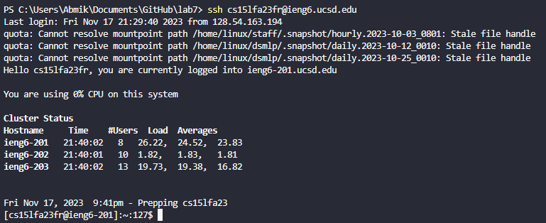
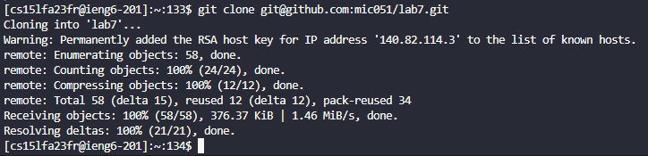
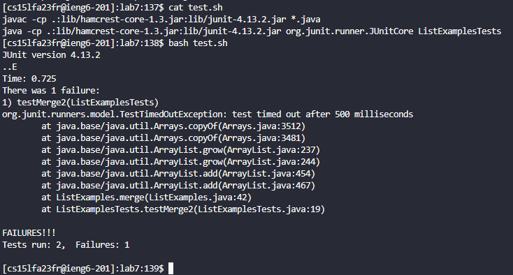
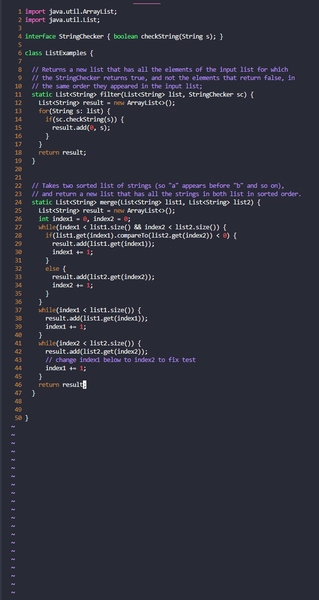
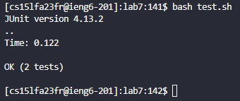
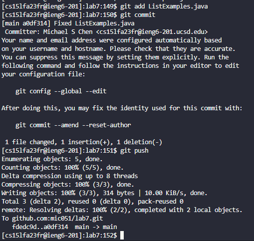
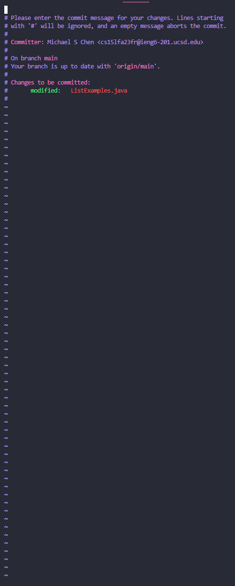

# Lab Report 4

## Step 4

To log into my ieng6 account (cs15lfa23fr@ieng6.ucsd.edu), I typed `ssh cs15lfa23fr@ieng6.ucsd.edu` and `<enter>`. The command logged me into ieng6 and since I have my ssh keys setup, the command line didn't prompt me for a password.

## Step 5

To clone my fork, I grabbed the ssh link from Github (git@github.com:mic051/lab7.git) and type `git clone git@github.com:mic051/lab7.git` and `<enter>`. I did copy the link from the course page and pasted it in with <ctrl> v.

## Step 6

To run the tests, I typed ran `cd lab7` and `<enter>` to get within the cloned repository and typed `bash test.sh` and `<enter>`. test.sh contains commands to compile all java files and run the tests, as seen in the `cat` output above. Looking at the output of running the tests, the first test passed and the second one failed due to timing out.

## Step 7

Firstly, I typed `vim ListExamples.java` and `<enter>`, which opens vim for ListExamples.java, as seen in the screenshot. Normally, line numbers aren't enabled. To enable them, I typed `:set number 43`. Next, I typed `43` and `<enter>`, which moves the cursor down 43 lines. I next type `5l`, which moves the cursor left 5 times. After that, I type `x`, which removes the character under the cursor, which is the "2" in "index2". Next, I type `i`, which changes vim from normal mode to insert mode. After that, I type `2`, which inserts "2" at the position of my cursor. After that, I type `<esc>`, which exits insert mode and returns vim to normal mode. After that, I type `:wq` `<enter>`. :wq is a vim command to write to the file and quit after. `<enter>` is used to execute the command.

## Step 8

To run the tests, I typed `bash test.sh` and `<enter>` again. As seen in the screenshot, both tests ran successfully.

## Step 9

Firstly, I ran `git add ListExamples.java` to stage `ListExamples.java`, since that was the only file modified. After that, I ran `git commit`, to create a new commit. This opens vim, as seen in the second screenshot. Within vim, I pressed i to go into insert mode. After that, I type `Fixed ListExamples.java` for a commit message to keep track of changes down the line. After that, I pressed `<esc>`, which makes vim exit insert mode and return to normal mode. After that, I type `:wq` and `<enter>` for the same reasons in step 7. After vim closes and I'm back on the terminal, I type `git push`, which pushes my commit onto the main branch of the repository.
