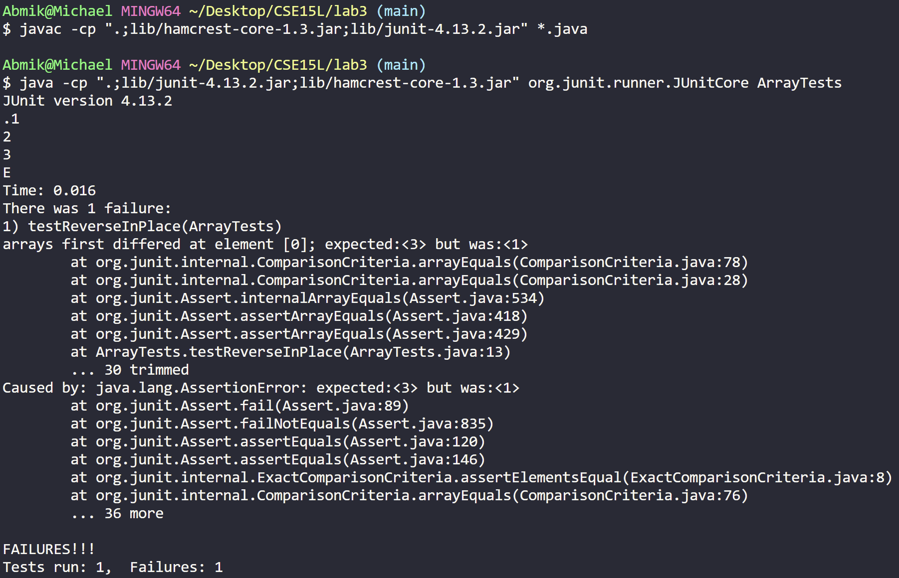
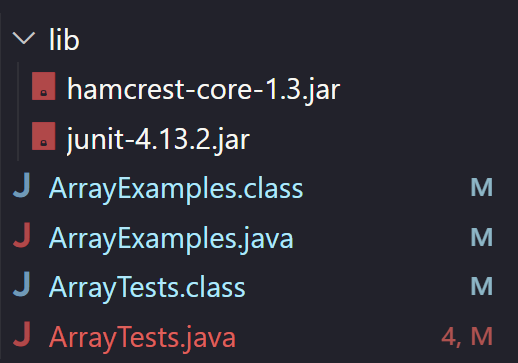
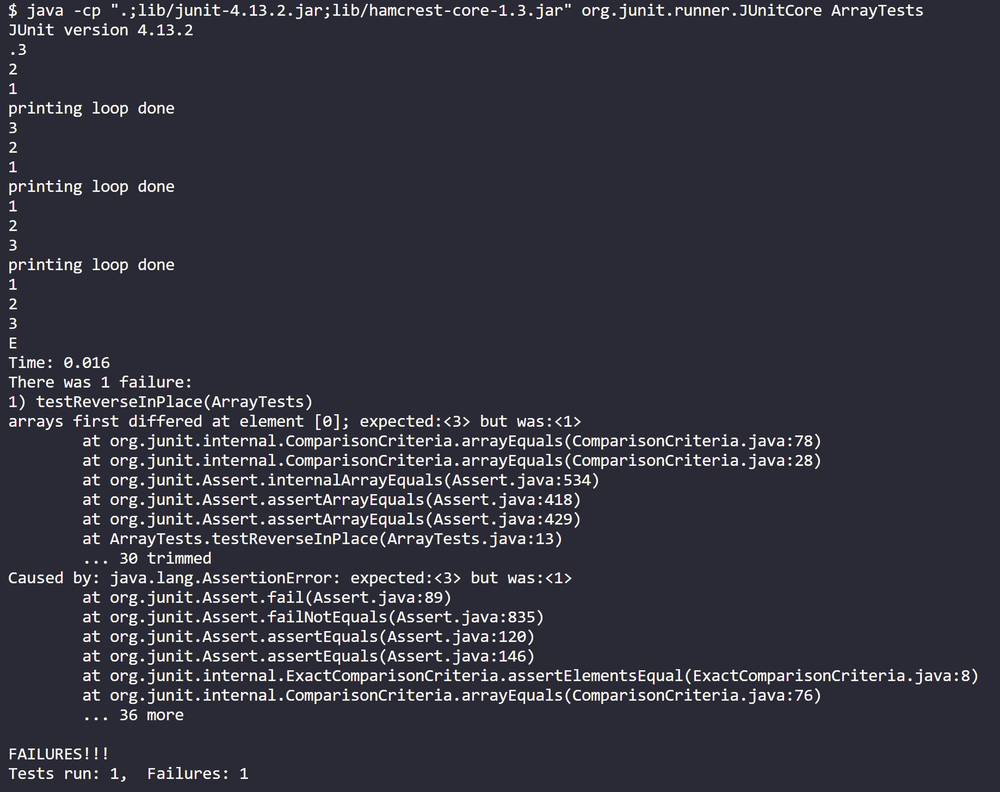
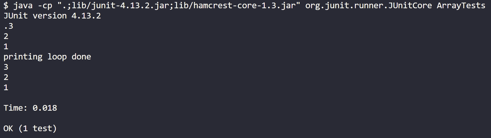

# Lab Report 5

## Part 1

Student - Hello. I tried writing a reversing function for an array but the reversing doesn't seem to work. What is the issue? Code, output, and file structure below.

TA - Hello. You almost got the reversing function working. I would recommend tracing the entire function out from beginning to end.

Student - Hello. I traced the function and saw the issue. It looks like I'm swapping twice, which undos the entire operation. I changed the loop to only iterate for half the length. Thanks for the help. Trace and output are below.

